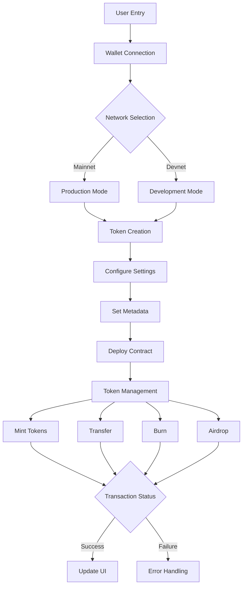

# 🌟 SOLmate: Your Ultimate Solana Token Creation dApp

<div align="center">
  
  
  [](https://solana.com/)
  [](https://nextjs.org/)
  [](https://www.typescriptlang.org/)
  [](https://opensource.org/licenses/MIT)
</div>

Transform your token ideas into reality with SOLmate - the most intuitive and powerful token creation platform on Solana. Built with cutting-edge technology and designed for both beginners and experts.


## ✨ Key Features

### Token Creation & Management
- ⚡ Create custom SPL tokens in minutes
- 🎯 Deploy tokens to any Solana network
- 🔄 Full token metadata management
- � Token minting and burning capabilities
- 📊 Real-time token analytics

### Wallet & Network
- 👛 Support for all major Solana wallets
- � Cross-network compatibility (Mainnet, Devnet, Testnet)
- 🔌 Seamless network switching
- 💸 Real-time SOL balance tracking
- 🛡️ Secure transaction signing

### Advanced Features
- 📨 Token airdrop functionality
- 🎨 Custom token branding options
- � Responsive design for all devices
- 🚀 Gas-optimized transactions
- ⚙️ Advanced configuration options

## 🛠️ Tech Stack

### Frontend
- **Next.js** - React framework for production
- **TypeScript** - Static typing for JavaScript
- **Tailwind CSS** - Utility-first CSS framework
- **DaisyUI** - Tailwind CSS component library

### Blockchain
- **@solana/web3.js** - Solana blockchain interaction
- **@solana/spl-token** - Token program interactions
- **@metaplex-foundation/mpl-token-metadata** - Token metadata management

### State Management
- **Zustand** - Lightweight state management
- **Immer** - Immutable state updates

### UI Components
- **@heroicons/react** - Beautiful icons
- **react-spinners** - Loading animations
- **Lucide React** - Icon components

## 📊 Project Structure

```
src/
├── components/         # Reusable UI components
├── contexts/          # React context providers
├── hooks/            # Custom React hooks
├── models/           # TypeScript types and interfaces
├── pages/            # Next.js pages and routing
├── stores/           # Zustand store configurations
├── styles/           # Global styles and Tailwind config
├── utils/            # Utility functions
└── views/            # Page-specific view components
```

## 🔄 Application Architecture

### System Flow


### Token Creation Flow


### Smart Contract Architecture
```solidity
// SPL Token Contract Structure
contract SOLmateToken {
    // Token Details
    string public name;
    string public symbol;
    uint8 public decimals;
    uint256 public totalSupply;
    
    // Access Control
    address public owner;
    mapping(address => bool) public operators;
    
    // Balances & Allowances
    mapping(address => uint256) public balances;
    mapping(address => mapping(address => uint256)) public allowances;
    
    // Events
    event Transfer(address indexed from, address indexed to, uint256 value);
    event Approval(address indexed owner, address indexed spender, uint256 value);
    event Mint(address indexed to, uint256 value);
    event Burn(address indexed from, uint256 value);
}

## 📑 Pages

1. **Home** (`/`) - Landing page with project overview
2. **Create** (`/create`) - Token creation interface
3. **Airdrop** (`/airdrop`) - SOL airdrop functionality
4. **Token Metadata** (`/tokenMetadata`) - Manage token metadata
5. **Tools** (`/tools`) - Various token management tools
6. **FAQ** (`/faq`) - Frequently asked questions
7. **Contact** (`/contact`) - Get in touch form
8. **Donate** (`/donate`) - Support the project
9. **Features** (`/feature`) - Detailed feature list
10. **Offer** (`/offer`) - Special offers and plans

## 🚀 Getting Started

1. **Clone the repository**
   ```bash
   git clone https://github.com/R0hit-Yadav/Solana_Token.git
   cd Solana_Token
   ```

2. **Install dependencies**
   ```bash
   npm install
   ```

3. **Start the development server**
   ```bash
   npm run dev
   ```

4. **Build for production**
   ```bash
   npm run build
   ```

## 🔧 Configuration

The project uses several configuration files:
- `next.config.js` - Next.js configuration
- `tailwind.config.js` - Tailwind CSS customization
- `tsconfig.json` - TypeScript configuration

## 🔐 Security & Best Practices

### Security Features
- 🛡️ Secure wallet connection protocols
- 🔒 Multi-signature support
- ✅ Transaction validation
- 🔍 Real-time security monitoring
- 🚫 Automated threat detection

### Smart Contract Security
- 📋 Comprehensive audit compliance
- 🔒 Access control implementation
- 🛑 Emergency pause functionality
- 💊 Reentrancy attack prevention
- 🔄 Rate limiting mechanisms

### Best Practices
- 📝 Extensive code documentation
- 🧪 Thorough testing protocols
- 🔄 Regular security updates
- 📊 Transaction monitoring
- 🚨 Incident response plan

## 🌐 Network Support

- Mainnet Beta
- Testnet
- Devnet
- Local Network

## 👥 Contributing

Contributions are welcome! Please feel free to submit a Pull Request.

## 📄 License

This project is licensed under the MIT License - see the LICENSE file for details.

## 🙏 Acknowledgments

- Solana Foundation
- Metaplex Foundation
- NextJS Team
- The entire open-source community

## 📞 Contact

For questions and support, please reach out through:
- GitHub Issues
- Contact form on the website
- Email: [your-email@example.com]

## 🔮 Roadmap & Future Plans

### Q4 2025
- [ ] Multi-token creation suite
- [ ] Advanced metadata management system
- [ ] Token analytics dashboard
- [ ] NFT integration capabilities
- [ ] Enhanced security features

### Q1 2026
- [ ] Token launchpad platform
- [ ] Automated market maker (AMM) integration
- [ ] Cross-chain bridge functionality
- [ ] Advanced tokenomics tools
- [ ] Community governance features

### Q2 2026
- [ ] Token staking platform
- [ ] DeFi protocol integration
- [ ] Advanced trading features
- [ ] Mobile application
- [ ] Enterprise solutions

## 💻 Development Updates

Latest Version: v0.1.0
Status: Active Development
Next Release: November 2025

### Recent Updates
- 🚀 Added SPL token creation wizard
- 🎨 Implemented new UI/UX design
- 🔧 Enhanced error handling
- 📱 Improved mobile responsiveness
- 🔒 Security patches

---

<div align="center">
  
  
  Made with ❤️ by [R0hit-Yadav](https://github.com/R0hit-Yadav)
  
  [Website](https://solmate.dev) · [Documentation](https://docs.solmate.dev) · [Twitter](https://twitter.com/solmate) · [Discord](https://discord.gg/solmate)
</div>

---

Made with ❤️ by [R0hit-Yadav](https://github.com/R0hit-Yadav)
